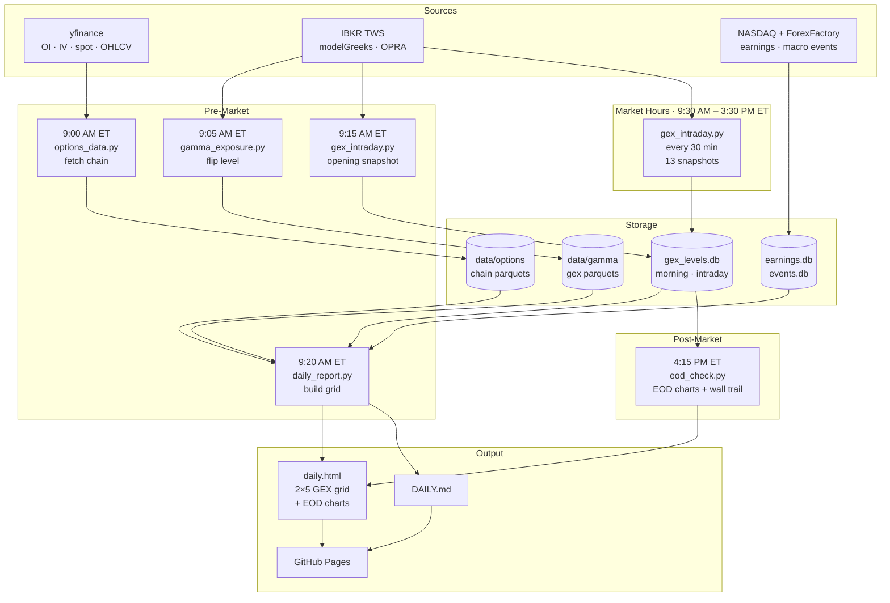

# tin-trades

Pre-market GEX pipeline for SPY, QQQ, IWM + MAG7. Fetches options chains, pulls real IBKR greeks every 30 minutes throughout the trading day, computes 0DTE and weekly gamma exposure, and publishes a daily brief + EOD chart to GitHub Pages.

**[→ daily.html](https://johanntin.github.io/tin-trades/daily.html)**

---

## Architecture



---

## Daily schedule

| Time ET | Time PT | Script | What |
|---------|---------|--------|------|
| 9:00 AM | 6:00 AM | `options_data.py` | Full chain — OI, IV, volume, bid/ask for all 10 tickers |
| 9:05 AM | 6:05 AM | `gamma_exposure.py` | IBKR real greeks → flip level → per-ticker GEX parquet |
| 9:15 AM | 6:15 AM | `gex_intraday.py` | **Opening plan** — first IBKR snapshot, writes to `intraday` table |
| 9:20 AM | 6:20 AM | `daily_report.py` | Reads 9:15 snapshot → 2×5 GEX grid → `daily.html` → git push |
| 9:35 AM | 6:35 AM | `options_data.py --quotes` | Patch bid/ask only (post-open update) |
| 9:30–3:30 | 6:30–12:30 | `gex_intraday.py` | 13 more snapshots every 30 min — tracks wall migration |
| 4:15 PM | 1:15 PM | `eod_check.py` | 5m candlestick charts + GEX level lines + wall trail → appended to `daily.html` → git push |
| Sunday | Sunday | `earnings.py` + `events.py` | Weekly earnings calendar + macro events |

---

## GEX system

### Two level sets per ticker

Every snapshot computes **0DTE** and **weekly** GEX separately:

| Set | Expiries | Use |
|-----|---------|-----|
| 0DTE | Today only | Highest gamma, intraday pin/magnet — what you trade |
| Weekly | All expiries within 7 days | Structural levels, stable through the week |

Both sets are shown on each tile and EOD chart.

### How levels are derived

```
net GEX    = Σ (call_oi − put_oi) × gamma × 100 × spot
wall       = strike with max |net GEX|          → gold  ★
support    = highest |GEX| strike ≤ spot        → cyan  ▼
resistance = highest |GEX| strike > spot        → magenta ▲
env        = NEG if net_0DTE < 0  (vol AMP — dealers amplify moves)
             POS if net_0DTE > 0  (vol PIN — dealers suppress moves)
```

Gamma comes from **IBKR `modelGreeks`** (OPRA subscribed, snapshot per contract). Falls back to Black-Scholes if market is closed or greeks unavailable.

### Wall migration trail (EOD chart)

`eod_check.py` reads all 14 intraday snapshots and overlays a dotted dark-gold trail on each chart showing where the 0DTE wall was at each snapshot. Converging toward price into the afternoon = strong pin forming.

---

## Tile layout

```
┌─────────────────────────────────────┐
│ SPY                          733.08 │  ← ticker + spot
│                               NEG ● │  ← 0DTE env
│ 736 ░░░░░░░░                        │
│ 735 ████████████████ ◆W             │  ← weekly wall
│ 734 ██████           ▲ R            │  ← 0DTE resistance
│ 733 ████████████████ ★              │  ← 0DTE wall (gold bar)
│ 732 ██████                          │
│ 731 ░░░                             │
├─────────────────────────────────────┤
│ 0D ★733  ▲734  ▼733                 │  ← 0DTE levels
│  W ◆735  △735  ▽733                 │  ← weekly levels
│ 0D -567B          W -857B           │  ← net GEX both sets
└─────────────────────────────────────┘
```

---

## Scripts

| Script | Role |
|--------|------|
| `gex.py` | Core GEX module — `bs_gamma`, `fetch_ibkr_greeks`, `chain_to_gex`, `levels`, `save_snapshot`, `load_snapshots` |
| `gex_intraday.py` | 30-min IBKR snapshot runner — writes to `intraday` table, BS fallback |
| `gamma_exposure.py` | Flip level + per-ticker GEX parquet at open (IBKR) |
| `options_data.py` | Options chain fetch via yfinance — OI, IV, volume, bid/ask |
| `daily_report.py` | HTML/MD report — reads 9:15 snapshot, renders 2×5 tile grid |
| `eod_check.py` | 5m candlestick charts with GEX levels + wall migration trail |
| `earnings.py` | Weekly earnings calendar (NASDAQ API) |
| `events.py` | Weekly macro events (ForexFactory, USD high-impact only) |
| `market_data.py` | 1m OHLCV candles for watchlist |
| `bot.py` | Telegram bot — `/gamma`, `/earnings`, `/events` |
| `trades.py` | Trade log |

---

## Data

```
data/
  options/{ticker}_chain_{year}.parquet     OI · IV · bid/ask · volume by expiry/strike
  gamma/{ticker}_gex_{year}.parquet         IBKR GEX by date/expiry/strike
  gamma/{ticker}_summary.json               latest flip + wall + net per ticker
  gamma/daily_summary.json                  all tickers, latest run
  gamma/gex_levels.db                       SQLite — morning + intraday snapshots
  earnings.db                               weekly earnings calendar
  events.db                                 macro events
  candles/{ticker}_{year}.parquet           1m OHLCV
```

### `gex_levels.db` schema

```sql
-- Written by daily_report.py at 9:20 AM ET
CREATE TABLE morning (
    date TEXT, ticker TEXT, snap_time TEXT, spot REAL,
    wall_0 REAL, support_0 REAL, resistance_0 REAL, net_0 REAL,
    wall_w REAL, support_w REAL, resistance_w REAL, net_w REAL,
    PRIMARY KEY (date, ticker));

-- Written by gex_intraday.py — 14 rows per ticker per day
CREATE TABLE intraday (
    date TEXT, ticker TEXT, snap_time TEXT, spot REAL,
    wall_0 REAL, support_0 REAL, resistance_0 REAL, net_0 REAL,
    wall_w REAL, support_w REAL, resistance_w REAL, net_w REAL,
    PRIMARY KEY (date, ticker, snap_time));
```

---

## Automation (launchctl)

All scripts run via macOS `launchctl`. Plists in `~/Library/LaunchAgents/`.

| Plist | Schedule PT |
|-------|-------------|
| `com.tintrades.optionsdata` | 6:00 AM + 6:35 AM daily |
| `com.tintrades.gamma` | 6:05 AM daily |
| `com.tintrades.gexintraday` | 6:15, 6:30, 7:00 … 12:30 (14 times) |
| `com.tintrades.daily` | 6:20 AM daily |
| `com.tintrades.eodcheck` | 1:15 PM daily |
| `com.tintrades.marketdata` | 1:30 PM daily |
| `com.tintrades.weekly` | Sunday 8:00 AM |
| `com.tintrades.bot` | Always on (KeepAlive) |

```bash
# load all
launchctl load ~/Library/LaunchAgents/com.tintrades.*.plist

# check status
launchctl list | grep tintrades

# reload one
launchctl unload ~/Library/LaunchAgents/com.tintrades.gexintraday.plist
launchctl load   ~/Library/LaunchAgents/com.tintrades.gexintraday.plist
```

---

## Setup

```bash
python3 -m venv .venv
.venv/bin/pip install -r requirements.txt
cp .env.example .env   # TELEGRAM_TOKEN + TELEGRAM_CHAT_ID
```

**IBKR:** TWS must be running with API enabled (`Edit → Global Configuration → API → Settings → Enable ActiveX and Socket Clients`). OPRA subscription required for live greeks (~$1.50/month non-pro).

---

## Config (`config.yaml`)

```yaml
ibkr:
  host: 127.0.0.1
  port: 7497                  # live TWS port (configured in TWS API settings)
  client_id: 10
  readonly: true
  gex_strikes_pct: 0.08       # ±8% of spot for greek fetch

watchlist: [SPY, QQQ, IWM]   # daily expirations Mon–Fri
mag7: [AAPL, NVDA, MSFT, AMZN, GOOGL, META, TSLA]  # Mon/Wed/Fri expirations
```

---

## CLI

```bash
# GEX
.venv/bin/python gex_intraday.py --force     # manual snapshot
.venv/bin/python gamma_exposure.py           # flip + parquet (requires TWS)

# Daily report
.venv/bin/python daily_report.py --force

# EOD charts
.venv/bin/python eod_check.py --force

# Options chain
.venv/bin/python options_data.py             # full chain
.venv/bin/python options_data.py --quotes    # bid/ask patch only

# Earnings / events
.venv/bin/python earnings.py                 # this week
.venv/bin/python earnings.py --next
.venv/bin/python events.py

# Telegram bot
set -a && source .env && set +a
.venv/bin/python bot.py
```

---

## Telegram bot

```
/gamma             SPY GEX (from latest snapshot)
/gamma QQQ         QQQ GEX
/earnings          this week
/earnings today
/earnings next
/events
/events next
```

---

## Logs

```
logs/
  gex_intraday.log    gex_intraday.py  (14 entries/day)
  gamma.log           gamma_exposure.py
  daily.log           daily_report.py
  eod.log             eod_check.py
  options.log         options_data.py
  weekly.log          earnings.py + events.py
  bot.log             bot.py
```
